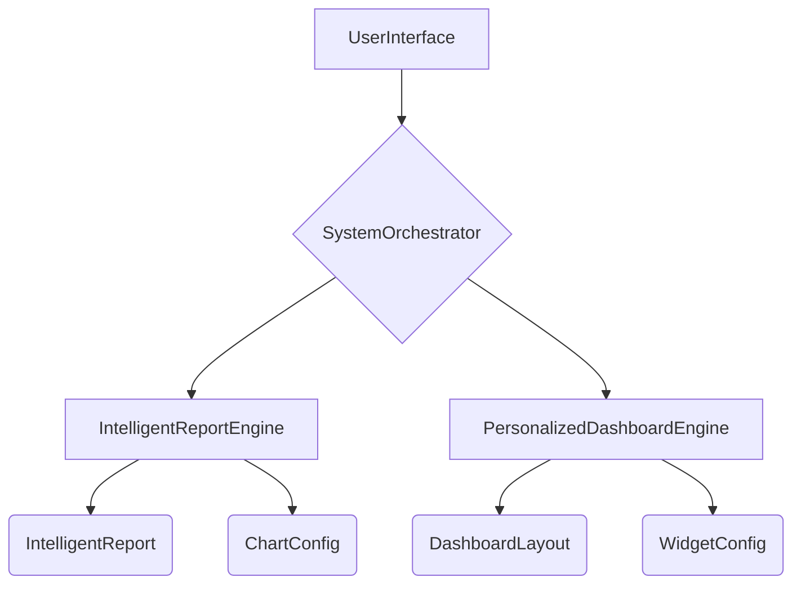

# WS12: Visualization & Reporting Intelligence - Implementation Details

**Document Version**: 1.0  
**Date**: December 2024  
**Author**: Manus AI  
**Purpose**: Technical implementation details for WS12 Visualization & Reporting Intelligence

---

## 1. Overview

WS12 transforms the True-Asset-ALLUSE system from a "quant black box" into a beautiful, understandable product through AI-driven report generation, smart charts, and personalized dashboards.

### Key Features
- **Intelligent Report Generation**: Automated reports with natural language explanations.
- **Smart Charts & Predictive Views**: AI-optimized visualizations and predictive charts.
- **Personalized Dashboards**: Adaptive dashboards that learn from user behavior.
- **Anomaly Highlighting**: Visual highlighting of detected anomalies.

### Core Components
- **IntelligentReportEngine**: Generates comprehensive reports with smart charts.
- **PersonalizedDashboardEngine**: Creates and optimizes personalized dashboards.

---

## 2. Architecture

### 2.1 Data Flow
1. **Data Aggregation**: The engines aggregate data from various workstreams (WS1, WS2, WS5, WS8, WS9).
2. **Report & Dashboard Generation**: The engines generate reports and dashboards based on templates and user behavior.
3. **Visualization**: The system uses a charting library to render smart charts and visualizations.
4. **Personalization**: The `PersonalizedDashboardEngine` tracks user interactions to optimize layouts.

### 2.2 Class Diagram

---

## 3. Implementation Details

### 3.1 IntelligentReportEngine
- **Report Templates**: Uses predefined templates for various report types (daily, weekly, risk, etc.).
- **Smart Charts**: Implements an AI-powered `create_smart_chart` method to optimize chart configurations.
- **Natural Language Generation**: Generates executive summaries and recommendations using AI-like analysis.
- **Data Simulation**: Uses simulated data fetching methods that can be replaced with real data sources.

### 3.2 PersonalizedDashboardEngine
- **Widget-Based Architecture**: Uses a flexible widget-based architecture for dashboards.
- **Role-Based Layouts**: Provides default layouts for different user roles (trader, risk manager, etc.).
- **User Behavior Tracking**: Tracks user interactions to learn preferences and optimize layouts.
- **Contextual Widgets**: Provides contextually relevant widgets based on market conditions.
- **Anomaly Highlighting**: Integrates with WS8 to highlight anomalies on the dashboard.

---

## 4. API & Integration

### 4.1 Internal API
- `generate_intelligent_report(report_type, user_id, parameters)`: Generates intelligent reports.
- `get_personalized_dashboard(user_id, user_role, preferences)`: Creates personalized dashboards.
- `add_anomaly_highlights(layout_id, anomalies)`: Adds anomaly highlights to dashboards.
- `track_user_interaction(user_id, widget_id, interaction_type, duration)`: Tracks user interactions.

### 4.2 Integration Points
- **WS6 (User Interface)**: The UI calls the WS12 API to generate reports and dashboards.
- **WS8 (ML Intelligence)**: Provides anomaly data to `add_anomaly_highlights`.
- **WS9 (Market Intelligence)**: Provides market context for reports and dashboards.
- **System Orchestrator**: Integrates WS12 with other workstreams and handles event-driven updates.

---

## 5. Future Enhancements

- **Predictive Charts**: Implement predictive charts showing potential future scenarios.
- **Advanced Personalization**: Use more sophisticated machine learning models for personalization.
- **Interactive Reports**: Add more interactivity to reports, such as drill-down capabilities.
- **Export Options**: Add options to export reports to PDF, Excel, and other formats.

---

**Document Status**: Complete  
**Next Steps**: Integrate with other workstreams and begin testing.

