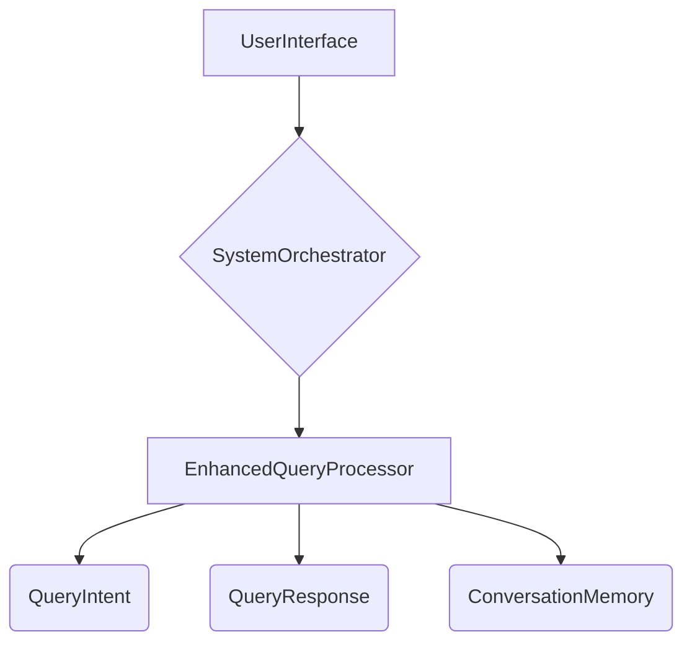

# WS16: Enhanced Conversational AI - Implementation Details

**Document Version**: 1.0  
**Date**: December 2024  
**Author**: Manus AI  
**Purpose**: Technical implementation details for WS16 Enhanced Conversational AI

---

## 1. Overview

WS16 builds upon the foundation of WS7 to provide advanced conversational AI capabilities, creating a killer front-end experience. It handles complex queries, maintains conversation memory, supports multiple languages, and provides contextual help.

### Key Features
- **Complex Query Understanding**: Handles queries like "Show me all positions impacted by VIX +20%".
- **Conversation Memory**: Maintains context across sessions for more natural conversations.
- **Multi-Language Support**: Supports multiple languages for global users.
- **Voice Interface**: Enables hands-free system interaction.
- **Contextual Help**: Provides intelligent, context-aware help and troubleshooting.

### Core Components
- **EnhancedQueryProcessor**: The main engine for processing complex queries.
- **ConversationMemory**: Manages conversation history and context.

---

## 2. Architecture

### 2.1 Data Flow
1. **Query Input**: The system receives queries via text or voice.
2. **Query Processing**: The `EnhancedQueryProcessor` preprocesses the query, extracts entities, and classifies intent.
3. **Context Resolution**: The processor resolves references using `ConversationMemory`.
4. **Response Generation**: The processor generates a response by querying relevant data sources and generating natural language.
5. **Memory Update**: The `ConversationMemory` is updated with the new interaction.

### 2.2 Class Diagram

---

## 3. Implementation Details

### 3.1 EnhancedQueryProcessor
- **Entity Extraction**: Uses pattern matching and NLP to extract entities like symbols, metrics, and timeframes.
- **Intent Classification**: Classifies query intent using keyword and pattern matching.
- **Complex Query Handling**: Uses query templates to handle complex queries like scenario analysis and impact analysis.
- **Multi-Language Support**: Implements a framework for handling multiple languages, including translation.
- **Voice Query Handling**: Includes a placeholder for speech-to-text conversion.

### 3.2 ConversationMemory
- **Session Management**: Manages conversation history and context for each user session.
- **Entity Memory**: Remembers key entities from the conversation to resolve references.
- **Context Stack**: Manages context for multi-turn conversations.

---

## 4. API & Integration

### 4.1 Internal API
- `process_complex_query(query, context)`: Processes complex natural language queries.
- `handle_multi_language_query(query, detected_language, context)`: Handles queries in multiple languages.
- `provide_contextual_help(context, help_topic)`: Provides contextual help.
- `handle_voice_query(audio_data, context)`: Handles voice queries.

### 4.2 Integration Points
- **WS6 (User Interface)**: The UI calls the WS16 API to process user queries.
- **WS7 (Natural Language)**: WS16 enhances the capabilities of the existing chatbot.
- **System Orchestrator**: Integrates WS16 with other workstreams to provide data and context for query responses.

---

## 5. Future Enhancements

- **Advanced NLP Models**: Replace pattern-based methods with advanced NLP models for entity extraction and intent classification.
- **Proactive Assistance**: Implement proactive assistance based on user behavior and context.
- **Deeper Integration**: Deeper integration with other workstreams to enable more complex actions and analysis.
- **Emotional Analysis**: Add emotional analysis to understand user sentiment and provide more empathetic responses.

---

**Document Status**: Complete  
**Next Steps**: Integrate with other workstreams and begin testing.

