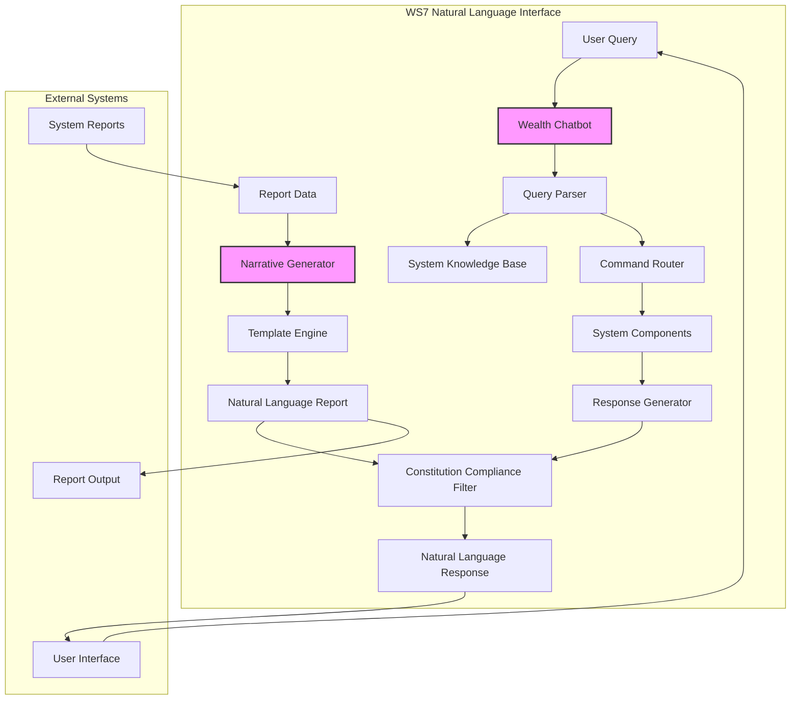

# WS7: Natural Language Interface & Chatbot - Implementation Details

**Version**: v1.0.0-ws7-complete
**Status**: ✅ COMPLETE

## 1. Overview

Workstream 7 (WS7) introduces a sophisticated Natural Language Interface and Chatbot system into the True-Asset-ALLUSE platform. This workstream provides human-friendly interaction capabilities while maintaining strict adherence to Constitution v1.3 principles. The system enables users to query system status, request reports, and interact with the platform using natural language, while ensuring **zero AI involvement in wealth management decisions**.

The WS7 system acts as an intelligent interface layer, translating natural language queries into system commands and providing narrative explanations of system behavior and performance.

## 2. Core Principles

- **Zero Decision-Making Authority**: The chatbot and narrative generator cannot initiate, modify, or override any trading or risk management decisions
- **Information Gateway**: Provides read-only access to system information and generates explanatory content
- **Constitution Compliance**: All responses are filtered through Constitution v1.3 compliance checks
- **Transparency**: All AI-generated content is clearly marked and traceable
- **Security**: Implements robust authentication and authorization controls

## 3. Architecture

The WS7 architecture consists of two primary components:

1. **Wealth Chatbot**: GPT-4 powered conversational interface for system interaction
2. **Narrative Generator**: Automated report narration and explanation system



## 4. Component Breakdown

### 4.1. Wealth Chatbot

**Purpose**: Provide natural language interface for system queries and commands

**Key Features**:
- GPT-4 powered natural language understanding
- System knowledge base with comprehensive True-Asset-ALLUSE information
- Query parsing and intent recognition
- Command routing to appropriate system components
- Context-aware conversation management
- Multi-turn conversation support
- Response formatting and presentation

**Supported Query Types**:
- System status inquiries ("What's the current system status?")
- Performance questions ("How did we perform this week?")
- Risk metric queries ("What's our current risk exposure?")
- Account information requests ("Show me account balances")
- Protocol status checks ("What protocol level are we at?")
- Historical performance questions ("What was our best performing week?")
- Configuration queries ("What are the current ATR settings?")

**Security Features**:
- User authentication and authorization
- Query logging and audit trails
- Rate limiting and abuse prevention
- Sensitive information filtering
- Command authorization checks

### 4.2. Narrative Generator

**Purpose**: Generate natural language narratives for reports and system explanations

**Key Features**:
- Automated report narration
- Performance explanation generation
- Risk assessment narratives
- Market condition descriptions
- System behavior explanations
- Customizable narrative styles and formats
- Multi-language support capability

**Narrative Types**:
- **Performance Narratives**: Explain weekly/monthly performance results
- **Risk Narratives**: Describe current risk posture and changes
- **Market Narratives**: Explain market conditions and their impact
- **System Narratives**: Describe system actions and decisions
- **Compliance Narratives**: Explain regulatory compliance status

## 5. Implementation Details

### 5.1. Wealth Chatbot Implementation

```python
class WealthChatbot:
    """
    GPT-4 powered chatbot for True-Asset-ALLUSE system interaction.
    
    Provides natural language interface while maintaining strict
    Constitution v1.3 compliance and zero decision-making authority.
    """
    
    def __init__(self):
        # Initialize GPT-4 client with system context
        # Load system knowledge base
        # Set up conversation management
        # Configure compliance filters
    
    async def process_query(self, query: str, user_context: dict) -> ChatbotResponse:
        # Parse user query and extract intent
        # Route to appropriate system component
        # Generate natural language response
        # Apply compliance filtering
        # Return formatted response
```

**Key Methods**:
- `process_query()`: Main query processing pipeline
- `parse_intent()`: Extract user intent from natural language
- `route_command()`: Route queries to system components
- `generate_response()`: Create natural language responses
- `apply_compliance_filter()`: Ensure Constitution v1.3 compliance

### 5.2. Narrative Generator Implementation

```python
class NarrativeGenerator:
    """
    Generates natural language narratives for reports and explanations.
    
    Creates human-readable explanations of system behavior, performance,
    and market conditions while maintaining factual accuracy.
    """
    
    def __init__(self):
        # Initialize narrative templates
        # Set up language models
        # Configure style preferences
        # Load domain-specific vocabulary
    
    async def generate_performance_narrative(self, performance_data: dict) -> str:
        # Analyze performance metrics
        # Generate explanatory narrative
        # Apply style and formatting
        # Return natural language explanation
```

**Key Methods**:
- `generate_performance_narrative()`: Create performance explanations
- `generate_risk_narrative()`: Explain risk metrics and changes
- `generate_market_narrative()`: Describe market conditions
- `generate_system_narrative()`: Explain system actions
- `customize_narrative_style()`: Adjust tone and complexity

## 6. Data Flow

### 6.1. Chatbot Query Flow
1. **User Input**: Natural language query received from user interface
2. **Authentication**: Verify user credentials and permissions
3. **Query Parsing**: Extract intent and parameters from natural language
4. **Command Routing**: Route to appropriate system component
5. **Data Retrieval**: Fetch requested information from system
6. **Response Generation**: Create natural language response
7. **Compliance Check**: Ensure response meets Constitution v1.3 requirements
8. **Response Delivery**: Return formatted response to user

### 6.2. Narrative Generation Flow
1. **Data Input**: Receive structured data from system reports
2. **Template Selection**: Choose appropriate narrative template
3. **Content Generation**: Generate explanatory text using AI
4. **Fact Verification**: Verify accuracy against source data
5. **Style Application**: Apply consistent narrative style
6. **Compliance Review**: Ensure compliance with system principles
7. **Output Delivery**: Provide final narrative content

## 7. Integration Points

### 7.1. System Integration
- **WS1 Rules Engine**: Query rule status and compliance information
- **WS2 Protocol Engine**: Access protocol levels and risk metrics
- **WS3 Account Management**: Retrieve account information and performance
- **WS4 Market Data**: Access market conditions and execution data
- **WS5 Portfolio Management**: Query portfolio metrics and analytics
- **WS6 User Interface**: Provide chatbot interface and narrative display
- **WS8 ML Intelligence**: Access insights and analytical reports

### 7.2. API Endpoints
- `/api/v1/chat/query` - Process natural language queries
- `/api/v1/chat/history` - Retrieve conversation history
- `/api/v1/narrative/generate` - Generate report narratives
- `/api/v1/narrative/templates` - Manage narrative templates

## 8. Security and Compliance

### 8.1. Security Measures
- **Authentication**: Multi-factor authentication for system access
- **Authorization**: Role-based access control for different query types
- **Encryption**: All communications encrypted in transit and at rest
- **Audit Logging**: Complete audit trail of all interactions
- **Rate Limiting**: Protection against abuse and excessive usage

### 8.2. Constitution v1.3 Compliance
- **No Decision Making**: Chatbot cannot initiate or modify trading decisions
- **Read-Only Access**: All queries are read-only system information requests
- **Compliance Filtering**: All responses filtered for compliance violations
- **Audit Trail**: Complete logging of all AI-generated content
- **Human Oversight**: All critical responses reviewed by human operators

## 9. Performance Metrics

### 9.1. Chatbot Metrics
- **Response Time**: Average query processing time < 2 seconds
- **Accuracy**: Intent recognition accuracy > 95%
- **User Satisfaction**: User satisfaction score > 4.5/5
- **Availability**: System uptime > 99.9%
- **Compliance**: Zero compliance violations

### 9.2. Narrative Generation Metrics
- **Generation Speed**: Report narrative generation < 30 seconds
- **Quality Score**: Narrative quality rating > 4.0/5
- **Accuracy**: Factual accuracy > 99.5%
- **Consistency**: Style consistency score > 90%

## 10. Testing and Validation

### 10.1. Chatbot Testing
- **Unit Tests**: Individual component functionality
- **Integration Tests**: End-to-end query processing
- **User Acceptance Tests**: Real user interaction scenarios
- **Security Tests**: Authentication and authorization validation
- **Performance Tests**: Load and stress testing

### 10.2. Narrative Testing
- **Content Accuracy**: Verification against source data
- **Style Consistency**: Narrative style and tone validation
- **Template Testing**: All narrative templates validated
- **Compliance Testing**: Constitution v1.3 compliance verification

## 11. Future Enhancements

### 11.1. Advanced Features
- **Voice Interface**: Speech-to-text and text-to-speech capabilities
- **Multi-Language Support**: Support for multiple languages
- **Advanced Analytics**: Enhanced query analytics and insights
- **Personalization**: User-specific response customization
- **Mobile Optimization**: Enhanced mobile interface support

### 11.2. AI Improvements
- **Context Awareness**: Enhanced conversation context management
- **Learning Capabilities**: Improved response quality over time
- **Domain Expertise**: Deeper financial domain knowledge
- **Explanation Quality**: More detailed and accurate explanations

## 12. Deployment and Operations

### 12.1. Deployment Architecture
- **Containerized Deployment**: Docker containers for scalability
- **Load Balancing**: Distributed query processing
- **Monitoring**: Real-time performance and health monitoring
- **Backup and Recovery**: Automated backup and disaster recovery

### 12.2. Operational Procedures
- **Monitoring**: 24/7 system monitoring and alerting
- **Maintenance**: Regular updates and maintenance windows
- **Support**: Technical support and user assistance
- **Documentation**: Comprehensive operational documentation

## 13. Conclusion

WS7 Natural Language Interface & Chatbot provides sophisticated human-computer interaction capabilities while maintaining strict adherence to the True-Asset-ALLUSE system principles. The implementation ensures zero AI involvement in wealth management decisions while providing powerful tools for system interaction and report generation.

The system enhances user experience and operational efficiency while maintaining the highest standards of security, compliance, and reliability required for a professional wealth management platform.

