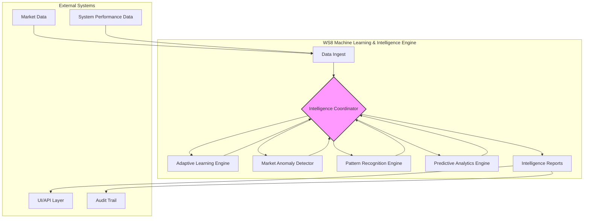

# WS8: Machine Learning & Intelligence Engine - Implementation Details

**Version**: v1.0.0-ws8-phase2
**Status**: ↔️ IN PROGRESS

## 1. Overview

Workstream 8 (WS8) introduces a sophisticated Machine Learning and Intelligence Engine into the True-Asset-ALLUSE system. Its primary mission is to provide **advisory insights**, enhance situational awareness, and improve system understanding without ever influencing wealth management decisions. All trading and risk management actions remain **100% rules-based**, in strict adherence to Constitution v1.3.

The engine is designed to learn from historical data, detect market anomalies, recognize patterns, and provide predictive analytics to the system operator. It acts as an intelligent observer, not a decision-maker.

## 2. Core Principles

- **Zero AI in Decision-Making**: No component of WS8 can alter, override, or directly trigger any trading or risk management action. Its output is for informational and analytical purposes only.
- **Advisory Role**: The engine provides insights, alerts, and forecasts to the human operator and other system components for reporting and analysis.
- **Modularity**: Each ML component is designed as a standalone module with clear responsibilities, allowing for independent development, testing, and maintenance.
- **Adaptability**: The system is designed to learn and adapt over time as it processes more data, continuously improving the quality of its insights.
- **Transparency**: All ML models and their outputs are designed to be as interpretable as possible, with clear confidence scores and supporting data.

## 3. Architecture

The WS8 architecture is composed of five key components:

1.  **Adaptive Learning Engine**: Learns from historical week types, market conditions, and system performance to identify long-term patterns and relationships.
2.  **Market Anomaly Detector**: Identifies unusual market behavior and system performance deviations in real-time.
3.  **Pattern Recognition Engine**: Recognizes recurring market patterns and conditions based on historical data.
4.  **Predictive Analytics Engine**: Provides advisory forecasts for key market and performance metrics.
5.  **Intelligence Coordinator**: Orchestrates the other components, aggregates insights, and generates comprehensive intelligence reports.

## 4. Component Breakdown

### 4.1. Adaptive Learning Engine

-   **Purpose**: To learn from the system's history and identify relationships between market conditions, system actions, and outcomes.
-   **Key Features**:
    -   Learns from `WeekType`, `WeekPerformance`, and other high-level classifications.
    -   Uses `RandomForestClassifier` for week type prediction and `GradientBoostingRegressor` for performance forecasting.
    -   Continuously retrains as new data becomes available.
    -   Generates `LearningInsight` objects with confidence scores and recommendations.

### 4.2. Market Anomaly Detector

-   **Purpose**: To detect unusual market conditions and system performance anomalies.
-   **Key Features**:
    -   Uses `IsolationForest` for unsupervised anomaly detection.
    -   Monitors multiple anomaly types, including market volatility, price movements, volume, and system performance.
    -   Calculates statistical baselines to identify significant deviations.
    -   Generates `AnomalyAlert` objects with severity levels (Low, Medium, High, Critical).

### 4.3. Pattern Recognition Engine

-   **Purpose**: To identify recurring market patterns and regimes.
-   **Key Features**:
    -   Uses clustering algorithms (`DBSCAN`) and time series analysis to define and recognize patterns.
    -   Identifies patterns such as high/low volatility regimes, trending/ranging markets, and seasonal effects.
    -   Generates `PatternMatch` objects when a known pattern is detected.

### 4.4. Predictive Analytics Engine

-   **Purpose**: To provide advisory forecasts for key metrics.
-   **Key Features**:
    -   Uses time series models (`ARIMA`) and regression models (`Lasso`) for forecasting.
    -   Generates `Forecast` objects with prediction intervals and confidence scores.
    -   All forecasts are clearly marked as **advisory only**.

### 4.5. Intelligence Coordinator

-   **Purpose**: To orchestrate all WS8 components and synthesize their outputs into a unified intelligence picture.
-   **Key Features**:
    -   Acts as the central hub for data processing and insight generation.
    -   Aggregates insights, alerts, patterns, and forecasts into a `SystemIntelligence` object.
    -   Generates comprehensive `IntelligenceReport` objects for system operators.
    -   Manages the operational mode of the intelligence engine (e.g., `COMPREHENSIVE`, `SILENT`).

## 5. Data Flow

1.  **Data Ingestion**: The `IntelligenceCoordinator` receives market and system data from other workstreams.
2.  **Data Processing**: The data is passed to the relevant ML components for processing and analysis.
3.  **Insight Generation**: Each component generates its specific output (insights, alerts, patterns, forecasts).
4.  **Aggregation**: The `IntelligenceCoordinator` aggregates these outputs into a single, coherent `SystemIntelligence` snapshot.
5.  **Reporting**: The coordinator generates `IntelligenceReport` objects, which are sent to the UI, API layer, and audit trail.

## 6. Testing & Validation

-   **Unit Tests**: Each component has a comprehensive suite of unit tests to ensure its correctness and robustness.
-   **Integration Tests**: The `IntelligenceCoordinator` is tested to ensure it correctly orchestrates all components and handles their outputs.
-   **Performance Benchmarking**: The ML models are benchmarked for training time, inference speed, and predictive accuracy.
-   **Compliance Validation**: All outputs are validated to ensure they do not violate Constitution v1.3 and are clearly marked as advisory.

## 7. Future Enhancements

-   **Online Learning**: Implement online learning models to allow for more rapid adaptation to changing market conditions.
-   **Explainable AI (XAI)**: Integrate XAI techniques (e.g., SHAP, LIME) to provide more transparent and interpretable model outputs.
-   **Advanced Pattern Recognition**: Explore more sophisticated pattern recognition techniques, such as deep learning-based approaches.

