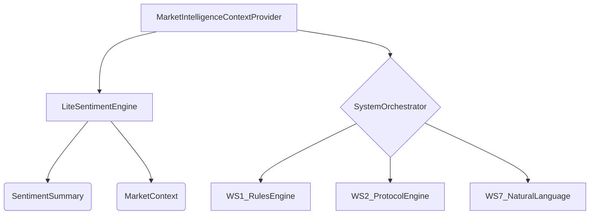

# WS9: Market Intelligence & Sentiment - Implementation Details

**Document Version**: 1.0  
**Date**: December 2024  
**Author**: Manus AI  
**Purpose**: Technical implementation details for WS9 Market Intelligence & Sentiment (Lite Version)

---

## 1. Overview

WS9 provides contextual market intelligence and sentiment analysis to enhance trading decisions and system narratives. This lite version focuses on providing high-level summaries and context around earnings and volatility spikes without deep feed processing.

### Key Features (Lite Version)
- **Contextual News/Sentiment Summaries**: Provides trading context for Gen-Acc/Rev-Acc.
- **Protocol Escalation Explanations**: Helps explain why protocol escalations happen.
- **Improved Narratives**: Enhances user and investor-facing narratives.
- **Lightweight Integration**: Minimal dependencies on external data feeds.

### Core Components
- **LiteSentimentEngine**: Performs keyword-based sentiment analysis on simulated news data.
- **MarketIntelligenceContextProvider**: Provides market intelligence context to other workstreams.

---

## 2. Architecture

### 2.1 Data Flow
1. **Simulated News Feeds**: The `LiteSentimentEngine` uses simulated news data for analysis.
2. **Sentiment Analysis**: The engine performs keyword-based sentiment scoring on news items.
3. **Context Generation**: The `MarketIntelligenceContextProvider` generates market context, trading narratives, and protocol escalation explanations.
4. **System Integration**: The context provider integrates with WS1, WS2, and WS7 to provide intelligence.

### 2.2 Class Diagram

---

## 3. Implementation Details

### 3.1 LiteSentimentEngine
- **Sentiment Scoring**: Uses predefined keyword lists for positive, negative, volatility, and earnings-related terms.
- **Caching**: Implements a 15-minute cache for sentiment summaries and market context to reduce redundant processing.
- **Simulated Data**: Uses simulated news items for analysis, which can be replaced with real data feeds in a full implementation.
- **Context Generation**: Generates contextual summaries for earnings and volatility.

### 3.2 MarketIntelligenceContextProvider
- **Protocol Escalation Context**: Provides human-readable explanations for protocol escalations by combining technical reasons with market context.
- **Trading Narratives**: Generates contextual trading narratives for entries, exits, and rolls.
- **Dashboard Summaries**: Creates concise market summaries for UI dashboards.
- **Comprehensive Intelligence**: Provides a unified intelligence object for other workstreams.

---

## 4. API & Integration

### 4.1 Internal API
- `get_protocol_escalation_context(level, reason, affected_symbols)`: Provides context for protocol escalations.
- `get_trading_narrative(action, symbol, details)`: Generates trading narratives.
- `get_market_summary_for_dashboard()`: Gets market summary for UI dashboards.
- `get_contextual_intelligence(symbols, include_market)`: Gets comprehensive intelligence.

### 4.2 Integration Points
- **WS2 (Protocol Engine)**: Calls `get_protocol_escalation_context` during escalations.
- **WS6 (User Interface)**: Calls `get_market_summary_for_dashboard` to display market context.
- **WS7 (Natural Language)**: Uses `get_trading_narrative` to enhance chatbot responses.
- **WS12 (Visualization)**: Uses `get_contextual_intelligence` for report generation.

---

## 5. Future Enhancements

- **Real-Time Data Feeds**: Integrate with real-time news and sentiment data providers.
- **Machine Learning Models**: Replace keyword-based sentiment analysis with advanced NLP models.
- **Social Media Integration**: Add support for social media sentiment analysis.
- **Deeper Analysis**: Implement deeper analysis of news content, including topic modeling and event detection.

---

**Document Status**: Complete  
**Next Steps**: Integrate with other workstreams and begin testing.md and test with other workstreams.

